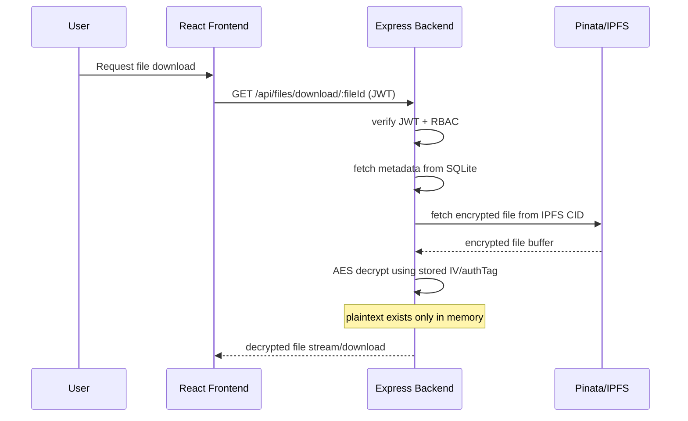

# Phase 2 — Secure Retrieval + AES Decryption Pipeline

## Overview

Phase 2 adds secure encrypted medical file retrieval to the EHR platform.

Files uploaded during Phase 1 already:

* use AES encryption
* are stored encrypted on IPFS via Pinata
* have metadata stored in SQLite

This phase introduces:

* secure file retrieval
* AES decryption
* JWT-protected download endpoints
* role-aware file access validation
* streaming decrypted files back to frontend

IMPORTANT:
This phase still does NOT implement:

* advanced patient consent validation
* decentralized key management
* per-user encryption keys
* attribute-based encryption

Those belong to future phases.

---

# Retrieval Architecture

---

# AES Decryption Lifecycle

If AES-256-GCM was implemented in Phase 1:

* retrieve:

  * IV
  * authTag
  * encryptionAlgorithm
* initialize decipher
* validate authTag
* decrypt encrypted buffer

Requirements:

* plaintext files must never be permanently stored
* decryption occurs only in memory
* reject tampered encrypted files

If encrypted content fails integrity validation:

* return secure generic error
* do NOT expose cryptographic internals

---

# Retrieval Rules

## Allowed Roles

* patient
* doctor

Phase 2 access rules:

### Patient

Can retrieve:

* only their own files

### Doctor

Can retrieve:

* any patient file for now

IMPORTANT:
Advanced consent-aware retrieval belongs to Phase 3.

Do NOT implement blockchain consent validation yet.

Keep Phase 2 focused on:

* retrieval pipeline
* decryption pipeline
* secure streaming

---

# Backend Endpoints

## GET /api/files/download/:fileId

Protected route.

Behavior:

1. validate JWT
2. validate RBAC
3. fetch file metadata
4. fetch encrypted file from IPFS
5. decrypt server-side
6. stream original file back

Response:

* correct MIME type
* original filename
* attachment headers

---

Use Existing Endpoint:
POST /api/files/getByPatient

Requirements:

* Ensure this endpoint continues to work as implemented in Phase 1.
* Do NOT redesign or duplicate the route.
* Ensure it returns metadata only:

  * fileId
  * originalFileName
  * mimeType
  * uploadTimestamp
  * uploadedBy

Do NOT return:

* plaintext file data
* AES keys
* authTag
* IV
* encrypted binary content

---

# SQLite Metadata Requirements

Continue using:
medical_files table

If using AES-GCM:
ensure fields exist:

* encryptionAlgorithm
* authTag

No plaintext content stored.

---

# FRONTEND REQUIREMENTS

Extend existing React frontend.

Add:

* uploaded files table
* download buttons
* loading states
* download error handling

Integrate into:

* Patient Dashboard
* Doctor Dashboard

---

# FRONTEND FLOW

Patient:

* views uploaded files
* downloads own files

Doctor:

* views patient file list
* downloads files

Files should download normally:

* PDF opens
* images open
* browser download works

Frontend should NEVER receive:

* AES key
* IV
* authTag

Decryption remains backend-only.

---

# SECURITY REQUIREMENTS

* Never expose AES key
* Never expose authTag unnecessarily
* Never persist plaintext files
* Reject tampered encrypted content
* Protect all endpoints with JWT
* Validate ownership before retrieval
* Stream files instead of writing temp plaintext files if possible

---

# PROJECT STRUCTURE

Possible backend additions/modifications:

* services/decryptionService.js
* services/ipfsService.js
* controllers/fileController.js
* routes/fileRoutes.js

Frontend:

* components/FileTable.jsx
* services/fileApi.js
* dashboard integration

Maintain existing MVC architecture.

---

# TESTING REQUIREMENTS

## Backend Tests

1. Retrieve encrypted file from IPFS
2. AES decrypt successfully
3. Download PDF correctly
4. Download image correctly
5. Reject invalid JWT
6. Reject unauthorized patient access
7. Detect tampered encrypted content
8. Verify no plaintext files stored locally

## Frontend Tests

9. Uploaded files list renders
10. Download button works
11. Browser downloads decrypted file
12. Loading states work
13. Error handling works

---

# IMPORTANT

This phase is ONLY about:

* retrieval
* decryption
* secure file delivery

Do NOT implement:

* advanced blockchain consent validation
* encrypted sharing
* decentralized key exchange

Those belong to Phase 3.
