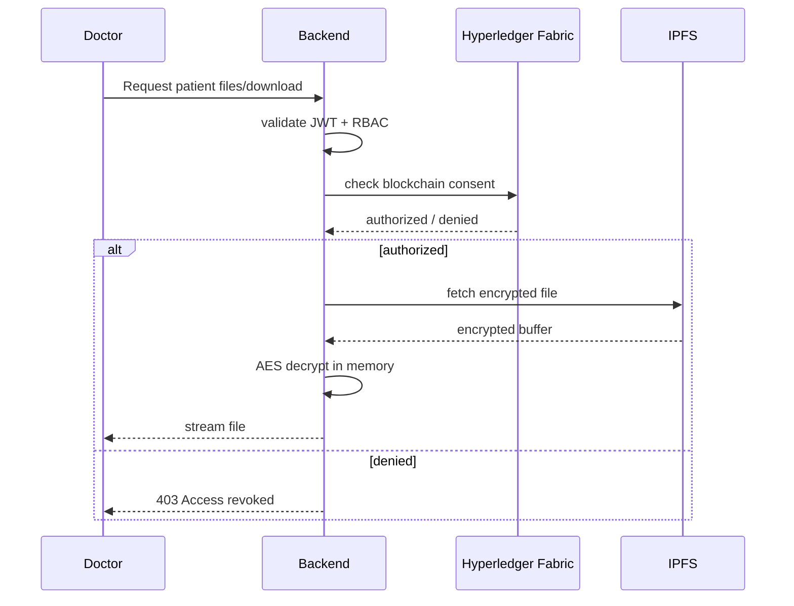

# Phase 3 — Consent-Aware Secure Medical File Access

## Overview

Phase 3 integrates blockchain-backed patient consent validation into the encrypted IPFS medical file system.

Act as a Senior Hyperledger Fabric + Cybersecurity Architect. You are continuing the development of our secure EHR platform. We have successfully completed Phase 1 (Upload/Encrypt) and Phase 2 (Retrieve/Decrypt).

The system already supports:

* AES-256-GCM encrypted uploads
* IPFS decentralized storage
* secure in-memory decryption
* JWT authentication
* RBAC protection
* ownership validation

This phase introduces:

* patient-controlled doctor authorization
* blockchain consent-aware downloads
* consent-aware file listing
* unified access validation

IMPORTANT:
This phase EXTENDS the current architecture.
Do NOT redesign:

* encryption pipeline
* IPFS services
* JWT authentication
* frontend dashboard architecture

---

# PRIMARY GOAL

Integrate existing blockchain consent workflows into encrypted file access.

Final secure flow:

Patient grants access
↓
Doctor attempts file access
↓
Backend validates blockchain consent
↓
If authorized:
fetch encrypted file from IPFS
decrypt in memory
stream file
Else:
reject access

---

# CONSENT SOURCE OF TRUTH

IMPORTANT:
The blockchain remains the source of truth for authorization.

Do NOT duplicate consent state inside SQLite.

Use existing chaincode access-control mechanisms.

Leverage existing:

* grantAccess
* revokeAccess
* patient-doctor authorization logic

Do NOT create a separate consent database.

---

# ACCESS CONTROL ARCHITECTURE

## Patients

Patients can:

* upload their own files
* list their own files
* download their own files

No consent validation needed for patient self-access.

---

## Doctors

Doctors can:

* access files ONLY if:

  * patient has granted blockchain access

If access revoked:

* doctor must immediately lose:

  * file listing access
  * download access

Consent validation must occur:

* BEFORE IPFS fetch
* BEFORE decryption

---

# VALIDATION FLOW

---

# CONSENT VALIDATION REQUIREMENTS

Reuse existing Fabric SDK + chaincode flows.

Possible approaches:

* existing access-control chaincode query
* patient metadata lookup
* authorization query transaction

IMPORTANT:
Do NOT hardcode:

* doctor IDs
* patient IDs
* bypasses

Consent must come dynamically from blockchain state.

---

# CENTRALIZED ACCESS VALIDATION

IMPORTANT:
Use the existing:
validateFileAccess()

function as the centralized authorization layer.

Extend it to support:

* blockchain consent checks
* doctor authorization checks
* future extensibility

Do NOT scatter consent logic across multiple controllers.

---

# BACKEND ENDPOINTS

Maintain existing routes.

Do NOT redesign APIs.

Continue using:

* POST /api/files/getByPatient
* GET /api/files/download/:fileId

But now:

* both routes must enforce blockchain consent validation for doctors.

---

# FILE LISTING RULES

## Patient

Can list:

* only own files

## Doctor

Can list:

* only files belonging to patients who granted access

If access revoked:

* patient disappears from doctor file listing immediately

---

# DOWNLOAD RULES

## Patient

Can always download own files.

## Doctor

Can download ONLY if:

* blockchain consent valid

Otherwise:

* return 403
* generic secure error message

Do NOT reveal excessive authorization details.

---

# FRONTEND REQUIREMENTS

Extend existing frontend behavior.

Doctor Dashboard:

* unauthorized patient searches should fail gracefully
* show consent-related access errors cleanly
* hide inaccessible file listings

Patient Dashboard:

* existing grantAccess/revokeAccess workflows remain source of truth
* no duplicate consent UI needed

---

# SECURITY REQUIREMENTS

* Consent validation MUST occur before IPFS fetch
* Consent validation MUST occur before AES decryption
* Never bypass blockchain authorization
* Never trust frontend authorization state
* Continue using in-memory decryption only
* Maintain JWT + RBAC protections

---

## PERFORMANCE REQUIREMENTS

Avoid excessive Fabric gateway reconnections.

Recommended:

* centralized consent-check helper/service
* reusable gateway handling

CRITICAL:
Use `evaluateTransaction()` (NOT `submitTransaction()`) for all blockchain consent validation queries.

Reason:
Consent checks are READ operations and must query peer state directly for low-latency authorization.

Do NOT use `submitTransaction()` for:

* consent validation
* authorization checks
* file-access queries

`submitTransaction()` should remain reserved for ledger-mutating operations like:

* grantAccess
* revokeAccess

Expected behavior:

* consent validation should complete in milliseconds
* file downloads should not wait for Fabric ordering/commit flow

---

# PROJECT STRUCTURE

Possible backend additions/modifications:

* services/accessControlService.js
* services/fabricService.js
* controllers/fileController.js

Frontend:

* DoctorDashboard.jsx
* FileTable.jsx
* error handling improvements

Maintain existing MVC architecture.

---

# TESTING REQUIREMENTS

## Backend Tests

1. Patient uploads file
2. Patient grants doctor access
3. Doctor lists patient files successfully
4. Doctor downloads file successfully
5. Patient revokes access
6. Doctor file listing immediately fails
7. Doctor download immediately fails
8. Unauthorized doctor receives 403
9. Patient still retains access to own files
10. Verify consent validation occurs before IPFS fetch

---

# FRONTEND TESTS

11. Doctor searches authorized patient → files visible
12. Doctor downloads authorized patient file
13. Doctor searches revoked patient → access denied UI
14. Patient revokes access → doctor UI reflects loss of access
15. Existing dashboards continue functioning

---

# IMPORTANT

Phase 3 scope is:

* blockchain consent-aware access control
* encrypted file authorization
* unified validation layer

Do NOT implement:

* per-user encryption keys
* decentralized key exchange
* encrypted sharing tokens
* advanced cryptographic research systems

Keep implementation practical and architecture-consistent.

---

# FINAL GOAL

At the end of Phase 3, the system should support:

* encrypted medical file uploads
* decentralized IPFS storage
* secure AES decryption
* blockchain-backed patient consent
* dynamic doctor authorization
* revocable medical file access

This completes the full secure medical document architecture.
