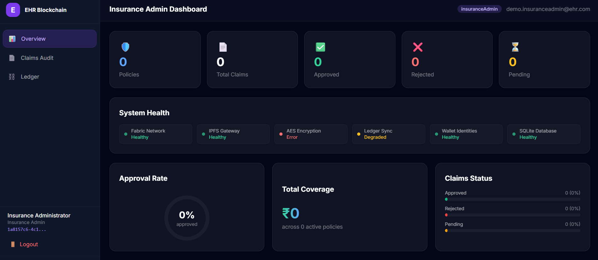
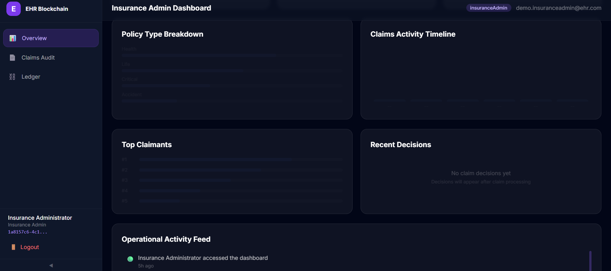
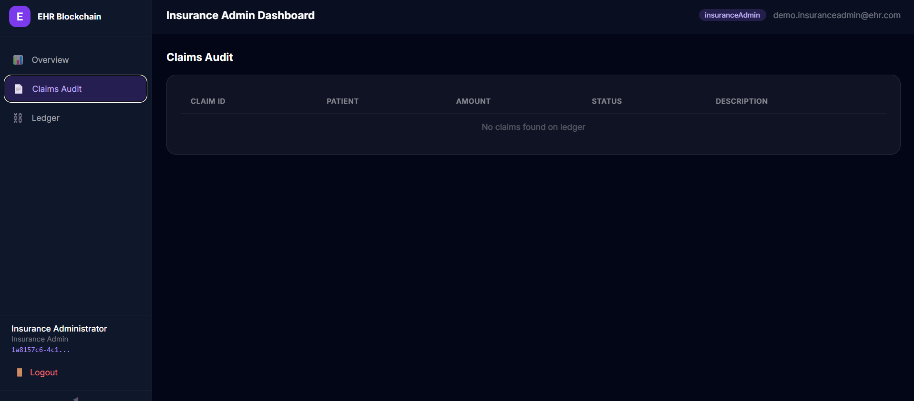
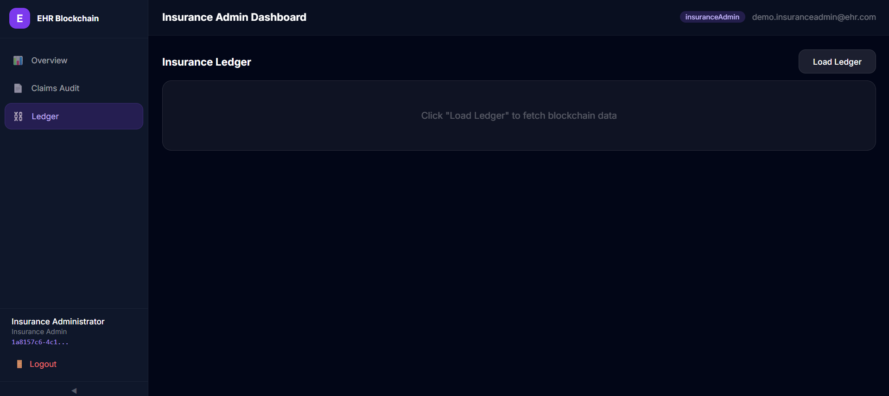
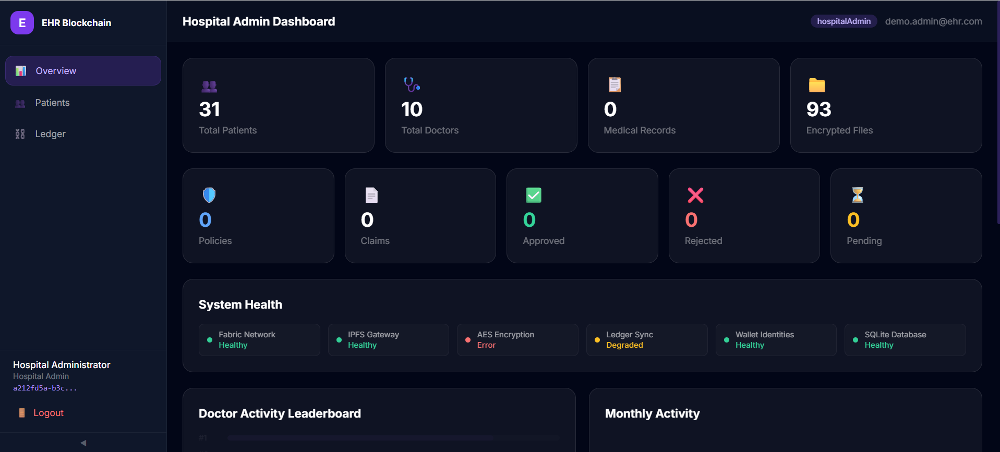
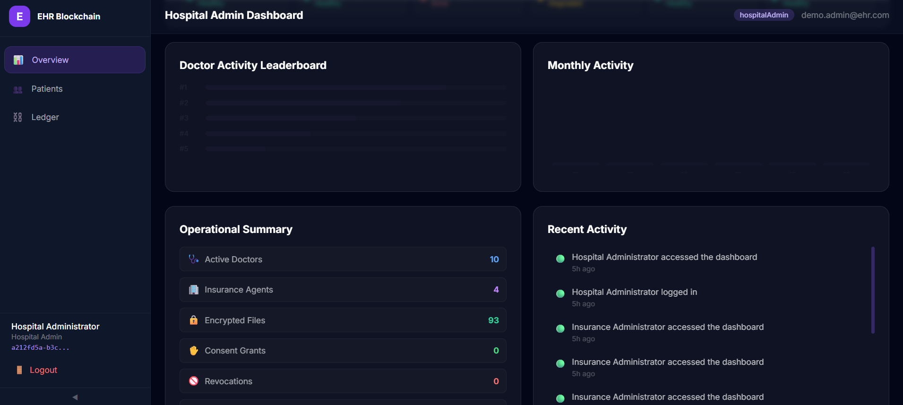

# MARKDOWN FILE

Save this as something like:

```text
DASHBOARD_ANALYTICS_SYNC_FIX.md
```

and paste EVERYTHING below into it.

---

# ENTERPRISE DASHBOARD DATA SYNC + ANALYTICS FIX

## CURRENT STATUS

The platform architecture is operational and healthy overall.

The following systems are CONFIRMED WORKING:

### VERIFIED WORKING

* JWT Authentication
* OTP Verification
* RBAC
* Hyperledger Fabric integration
* AES-256-GCM encryption
* IPFS uploads/downloads
* Consent validation
* Synthetic data generation
* Insurance claims processing
* Replay decision processing
* Audit logging
* Wallet synchronization
* Fabric identities
* Patient dashboard
* Doctor dashboard

---

# CONFIRMED SEEDED DATA

The seeding process completed successfully.

Final seed output:

* Patients: 28
* Doctors: 6
* Insurance Agents: 4
* Admin Accounts: 2
* Medical Records: 241
* Insurance Policies: 23
* Insurance Claims: 20
* File Entries: 112
* Decisions Processed: 18
* Failed Decisions: 0

This proves:

* the data EXISTS
* the ledger contains data
* policies and claims were successfully created
* dashboards are FAILING TO FETCH / AGGREGATE correctly

NOT a seeding issue anymore.

---

# PRIMARY PROBLEM








I have attached screenshots of the Insurance admin and hospital admin dashboards,
if you can see them that's ok. If not, I have described the problem in detail below.

In human words ,
## ISSUE:

!In my demo admin dashboard, I logged in as the demo admin, and I can see the patients and doctors, but I cannot see the count of medical records. I don't know why, but I cannot see medical records. Also, I cannot see policies, claims, approved, rejected, pending. I cannot see the data is still not loading. And also in the system health, it is showing that AES encryption has error. I don't know why. Also, the doctor activity leaderboard, leader board is like blank. Monthly activity is blank. And in the recent activity, there is the, I can see the activities that I did like five hours ago, but what I am doing right now, I logged in as a patient, demo patient in my incognito window, and the recent activity still does not show that. I don't know why it does not show that. It's still saying that it's still showing the activity of five hours ago. It's not showing the activity of the, it's not showing me any recent activity. And in the insurance dashboard, when I log in as the demo insurance admin, yeah, what happens is that I cannot see anything. It still says zero policies, zero total claims, zero approved, zero rejected, zero pending, everything is zero. Total coverage is zero, approval rate is zero, policy type breakdown is blank, claim activity timeline is blank, claim status is everything is zero, zero, zero, recent decisions, nothing, top claims, nothing. And it also does not show the activity. It's only showing me activity of five hours ago. And also there are three options, overview, claims sorted, and ledger, and when I click on load ledger, nothing is loading. It's not, and when I click on order, there is no data. And yeah, I don't know what's the error here and why it's not fetching the data. What should I do?

these are the errors. 

## CRITICAL OBSERVATION

The dashboards now render visually,
BUT:

* analytics values remain 0
* graphs are empty
* timelines empty
* leaderboard empty
* claims audit empty
* recent activity stale
* ledger fetches fail silently
* system health partially incorrect

This is now:

## a DASHBOARD DATA AGGREGATION + API SYNC issue

NOT:

* Fabric corruption
* seeding failure
* wallet failure
* claim processing failure

---

# ROOT CAUSE HYPOTHESIS

The issue is likely caused by ONE OR MORE of the following:

## POSSIBLE FAILURE POINTS

### 1. Analytics APIs querying wrong source

Examples:

* querying SQLite instead of ledger
* querying old DB
* querying stale cache
* querying empty arrays

---

### 2. Dashboard role mismatch

Possible:

* insuranceAdmin routes use hospital-only endpoints
* wrong org context
* JWT role mismatch during analytics calls

---

### 3. Fabric parsing failure

Possible:

* analytics aggregation not parsing ledger records correctly
* recordType mismatch
* insurance claims not filtered correctly
* claims stored under unexpected keys

---

### 4. Cache staleness

Possible:

* dashboard cache never invalidates
* old empty state persists
* analytics service cached before reseeding

---

### 5. Audit logging not refreshing

Possible:

* frontend only fetches activity once
* polling disabled
* stale state
* missing dependency arrays in React hooks

---

### 6. AES health check is incorrect

AES is clearly functioning because:

* encrypted downloads work
* IPFS decryption works
* AES uploads work

Therefore:
AES "ERROR" status is false-negative logic.

---

# REQUIRED FIXES

# 1. FULL ANALYTICS TRACE DEBUGGING

IMPORTANT:
Trace the ENTIRE analytics flow end-to-end.

From:

* Fabric ledger
* SQLite
* aggregation services
* analytics endpoints
* React API calls
* frontend state
* dashboard rendering

Find EXACTLY where:
the counts become zero.

DO NOT GUESS.

Log:

* raw ledger response
* aggregation results
* API responses
* frontend received payloads

---

# 2. FIX HOSPITAL ADMIN DASHBOARD

Currently broken:

* medical records count = 0
* policies = 0
* claims = 0
* approved/rejected/pending = 0
* doctor leaderboard empty
* monthly activity empty

Required:
Populate EVERYTHING using REAL data.

Expected:

* Medical Records → 241+
* Policies → 23
* Claims → 20
* Approved/Rejected counts
* Active doctors
* Monthly upload activity
* Timeline visualization

---

# 3. FIX INSURANCE ADMIN DASHBOARD

Currently broken:

* all metrics 0
* claims audit empty
* timeline empty
* ledger empty
* recent decisions empty
* policy breakdown empty

Required:
Fetch REAL insurance ledger analytics.

IMPORTANT:
Insurance dashboard must ONLY use:
insuranceAdmin-compatible endpoints.

Do NOT use:
hospital-only ledger routes.

---

# 4. FIX LEDGER FETCHING

Currently:
Load Ledger button does nothing.

Required:

* trace ledger fetch API
* verify route
* verify JWT role authorization
* verify Fabric org context
* verify returned payload

Add:
proper loading state
proper error state
proper empty-state fallback

---

# 5. FIX RECENT ACTIVITY LIVE UPDATES

Current issue:
activity feed still shows:
"5 hours ago"

even after:

* new login
* new actions
* new uploads

Required:
Implement REAL-TIME refresh.

Recommended:

* lightweight polling every 15 seconds
  OR
* dashboard refresh on visibility focus

Recent activity MUST update automatically.

---

# 6. FIX AES HEALTH STATUS

AES is operational.

Current dashboard incorrectly shows:
AES Encryption → ERROR

Required:
Replace fake status logic with REAL validation.

Validation should check:

* AES_SECRET exists
* encryption helper loads
* recent encrypt/decrypt success

If valid:
show HEALTHY.

---

# 7. FIX LEDGER SYNC STATUS

Current:
Ledger Sync shows:
DEGRADED

Required:
Use REAL validation:

* Fabric gateway reachable
* evaluateTransaction succeeds
* latest block fetch works

If successful:
show HEALTHY.

---

# 8. POPULATE LEADERBOARDS

Doctor leaderboard must use:
REAL seeded analytics.

Examples:

* records created
* patient count
* uploads handled
* claims involvement

Display:
Top 5 active doctors.

---

# 9. POPULATE MONTHLY ACTIVITY

Current:
blank.

Required:
Generate:

* uploads timeline
* claims timeline
* records timeline
* grants/revokes timeline

Use:
lightweight CSS visualizations.

NO heavy chart libraries.

---

# 10. POPULATE CLAIMS AUDIT

Claims audit page currently empty.

Required:
Display:

* claim ID
* patient
* amount
* decision
* status
* timestamp

Use:
REAL ledger claims.

---

# 11. ADD REAL-TIME OPERATIONAL FEEL

Dashboards still feel:
too static.

Add:

* animated metric counters
* hover effects
* subtle transitions
* glow effects
* timeline animations
* live activity pulses
* realtime feeling

Make it feel:
enterprise-grade.

---

# 12. IMPROVE VISUAL DESIGN

Current dashboards are structurally good,
BUT visually too empty.

Required improvements:

* denser layouts
* better card hierarchy
* richer visual sections
* stronger analytics visuals
* mini trend indicators
* better typography
* gradient highlights
* animated health indicators
* metric trend arrows
* modern enterprise styling

The dashboards should feel:

* premium
* enterprise
* healthcare-tech
* blockchain-powered
* analytics-heavy
* operationally alive

---

# 13. NEVER SHOW EMPTY SECTIONS

Avoid:

* "No data"
* blank containers
* dead charts

Instead:
show:

* placeholders
* skeleton analytics
* faded bars
* default operational baselines

Dashboard should ALWAYS look populated.

---

# 14. IMPORTANT PERFORMANCE REQUIREMENTS

Use:
evaluateTransaction()

NOT:
submitTransaction()

for:

* analytics reads
* dashboard reads
* ledger reads

VERY important.

---

# 15. CACHE INVALIDATION

If caching exists:
invalidate analytics cache after:

* reseeding
* replayClaimDecisions
* uploads
* claim decisions

Avoid stale zero-state caches.

---

# 16. IMPORTANT DEBUGGING REQUIREMENT

Before patching:
analyze:

* ALL analytics endpoints
* ALL aggregation services
* ALL dashboard hooks
* ALL API calls
* ALL ledger fetches
* ALL caching logic
* ALL audit polling logic

DO NOT randomly patch components.

Trace the ENTIRE flow correctly.

---

# 17. EXPECTED FINAL RESULT

After fixes:

## HOSPITAL ADMIN DASHBOARD

Should show:

* patients
* doctors
* records
* encrypted files
* policies
* claims
* approved/rejected/pending
* active leaderboard
* timelines
* operational summary
* live activity feed
* healthy system health

---

## INSURANCE ADMIN DASHBOARD

Should show:

* active policies
* claims
* approvals/rejections
* coverage totals
* claim distributions
* timelines
* top claimants
* recent decisions
* claims audit
* working ledger viewer
* operational activity

---

# 18. FINAL GOAL

The final dashboards should feel:

* enterprise-grade
* presentation-ready
* operationally alive
* analytics-rich
* healthcare-authentic
* visually premium
* blockchain-professional

---

# ATTACHED SCREENSHOTS

Analyze the attached screenshots carefully.

They show:

* current broken analytics state
* empty sections
* failed aggregation
* stale activity feeds
* incorrect health states
* empty insurance analytics
* blank timelines
* blank leaderboards

Use them as debugging references.

---

# EXECUTION REQUIREMENTS

IMPORTANT:
Analyze ENTIRE frontend/backend architecture first.

Cross-check:

* Fabric ledger
* SQLite
* analytics services
* dashboard hooks
* API responses
* aggregation logic
* caching
* React state
* JWT role handling
* insurance org context

Then implement fixes incrementally and safely.

---

# FINAL DELIVERABLES

After implementation provide:

* root-cause explanation
* analytics flow explanation
* dashboard architecture explanation
* caching explanation
* activity refresh explanation
* health-check explanation
* testing walkthrough
* demo walkthrough
* screenshots of corrected dashboards

---

