# Sanchay — Blockchain-Powered Electronic Health Record Platform

## Project Report

**Authors:** Deekshant Tilwani, Prateek Ray  
**Date:** May 2026  
**Platform:** Sanchay v1.0  
**Stack:** Hyperledger Fabric · React · Node.js · SQLite · IPFS · AES-256-GCM

---

## 1. Abstract

Sanchay is an enterprise-grade Electronic Health Record (EHR) platform that leverages Hyperledger Fabric's permissioned blockchain to deliver tamper-proof medical data management. The system implements a multi-organization Fabric network (Org1 for hospitals, Org2 for insurance) with role-based access control enforced at the smart contract level. Medical files are encrypted client-side using AES-256-GCM before being stored on IPFS via Pinata, ensuring that plaintext never leaves the server's memory. Patient consent is managed through blockchain-backed authorization arrays, enabling real-time grant/revoke of doctor access with immediate enforcement. The platform supports five distinct user roles — Patient, Doctor, Hospital Admin, Insurance Agent, and Insurance Admin — each with dedicated dashboards populated through a server-side analytics aggregation service. A synthetic data generation pipeline using Faker.js seeds realistic healthcare scenarios including medical records, insurance policies, claims with approval workflows, and consent relationships. JWT-based authentication with OTP email verification provides secure session management across a React frontend with protected routing.

---

## 2. Introduction

Healthcare data management faces a fundamental trust problem: centralized databases are vulnerable to unauthorized modification, lack transparent audit trails, and create single points of failure for sensitive patient information. Traditional EHR systems rely on perimeter-based security models where a compromised administrator can alter or delete medical records without detection.

Sanchay addresses these challenges by anchoring all critical healthcare transactions — patient registration, medical record creation, consent management, insurance policy issuance, and claim adjudication — on a Hyperledger Fabric blockchain. Unlike public blockchains, Fabric's permissioned architecture provides deterministic finality, identity-based access control through X.509 certificates, and channel-level data isolation, making it suitable for regulated healthcare environments.

The platform implements a defense-in-depth security model: JWT authentication gates API access, RBAC middleware enforces role-specific permissions, smart contract logic validates business rules, and AES-256-GCM encryption protects medical files at rest on IPFS. This layered approach ensures that no single compromised component can breach patient data confidentiality.

---

## 3. Problem Statement

Existing electronic health record systems suffer from several critical limitations:

1. **Centralized Trust Model:** Traditional databases require implicit trust in administrators who can modify or delete records without cryptographic proof of tampering.
2. **Fragmented Consent:** Patient consent for data sharing is typically managed through paper forms or siloed database flags, with no real-time enforcement or revocation capability.
3. **Insecure File Storage:** Medical documents stored on centralized servers or cloud storage lack client-side encryption, exposing plaintext to storage providers and insider threats.
4. **Opaque Audit Trails:** Conventional logging systems can be modified by privileged users, undermining regulatory compliance (HIPAA, GDPR).
5. **Interoperability Gaps:** Insurance claim workflows require manual coordination between healthcare providers and insurers, introducing delays and disputes over record authenticity.

---

## 4. Objectives

1. Implement a permissioned blockchain network using Hyperledger Fabric with multi-organization support (Hospital Org1, Insurance Org2).
2. Build a smart contract (`ehrChainCode`) that enforces role-based medical record management, patient consent, and insurance workflows at the chaincode level.
3. Develop an AES-256-GCM encryption pipeline that ensures medical files are encrypted before IPFS upload, with decryption keys stored separately in SQLite.
4. Create a JWT + OTP authentication system with Fabric CA integration for X.509 certificate-based identity management.
5. Design role-specific dashboards with server-side analytics aggregation for Hospital and Insurance administrators.
6. Implement a synthetic data generation system for realistic platform demonstration and testing.

---

## 5. Existing System Limitations

| Limitation | Impact | Sanchay's Solution |
|---|---|---|
| Mutable database records | Fraud, disputed authenticity | Immutable Fabric ledger with composite keys |
| Paper-based consent | Delayed access, no revocation | Blockchain `authorizedDoctors[]` array with real-time grant/revoke |
| Plaintext cloud storage | Data breaches | AES-256-GCM encryption before IPFS upload |
| Shared admin credentials | Insider threats | X.509 certificate per user via Fabric CA |
| Manual claim processing | Delays, disputes | On-chain claim lifecycle (PENDING → APPROVED/REJECTED) |
| No audit trail integrity | Compliance failures | Immutable blockchain + SQLite audit logs |

---

## 6. Proposed System

Sanchay implements a three-tier architecture:

**Tier 1 — React Frontend:** Single-page application with role-based routing, protected routes, and Axios-based API client with JWT interceptors.

**Tier 2 — Node.js Middleware:** Express.js server implementing MVC pattern with dedicated controllers (auth, EHR, file, user), service layer (encryption, IPFS, analytics, audit), and middleware stack (JWT verification, RBAC, error handling).

**Tier 3 — Blockchain + Storage:** Hyperledger Fabric network with two organizations, Fabric CA for identity management, CouchDB/LevelDB state database, IPFS via Pinata for decentralized file storage, and SQLite for off-chain metadata.

---

## 7. System Architecture

```mermaid
graph TB
    subgraph "Frontend - React + Tailwind"
        UI["React SPA"]
        AUTH_CTX["AuthContext"]
        API_SVC["API Service (Axios)"]
    end

    subgraph "Backend - Node.js + Express"
        MW["Middleware Stack<br/>JWT · RBAC · Error Handler"]
        CTRL["Controllers<br/>Auth · EHR · File · User"]
        SVC["Services<br/>Encryption · IPFS · Analytics · Audit"]
        DB["SQLite (better-sqlite3)<br/>Users · Files · Audit Logs"]
    end

    subgraph "Blockchain - Hyperledger Fabric"
        GW["Fabric Gateway"]
        CC["ehrChainCode<br/>(Smart Contract)"]
        PEER1["Org1 Peer<br/>(Hospital)"]
        PEER2["Org2 Peer<br/>(Insurance)"]
        CA1["Fabric CA Org1"]
        CA2["Fabric CA Org2"]
        ORD["Orderer"]
    end

    subgraph "Storage"
        IPFS["IPFS via Pinata"]
        WALLET["File System Wallet<br/>(X.509 Certs)"]
    end

    UI --> API_SVC
    API_SVC -->|"JWT Bearer"| MW
    MW --> CTRL
    CTRL --> SVC
    SVC --> DB
    SVC -->|"AES-256-GCM"| IPFS
    SVC --> GW
    GW --> CC
    CC --> PEER1
    CC --> PEER2
    PEER1 --> ORD
    PEER2 --> ORD
    CA1 --> WALLET
    CA2 --> WALLET
```

---

## 8. Technology Stack

| Technology | Version | Purpose | Rationale |
|---|---|---|---|
| **Hyperledger Fabric** | 2.2.x | Permissioned blockchain | Private transactions, identity-based ACL, deterministic finality — unlike Ethereum's public model |
| **React** | 18.x | Frontend SPA | Component architecture, virtual DOM, ecosystem maturity |
| **Node.js + Express** | 18.x / 4.21 | API server | Native Fabric SDK support, async I/O for blockchain queries |
| **SQLite (better-sqlite3)** | 11.7 | Off-chain metadata | Zero-config, WAL mode for concurrent reads, embedded with no external dependency |
| **IPFS (Pinata)** | Cloud | Decentralized file storage | Content-addressed, tamper-evident via CID, no single point of failure |
| **AES-256-GCM** | Node.js crypto | File encryption | Authenticated encryption with tamper detection via authTag |
| **JWT** | 9.0.2 | Session management | Stateless auth, embeds role/userId/uuid for zero-lookup middleware |
| **Tailwind CSS** | 3.x | UI styling | Utility-first, rapid prototyping, consistent design system |
| **Faker.js** | 9.0 | Synthetic data | Realistic healthcare data generation for testing |
| **Nodemailer** | 6.10 | OTP delivery | Gmail SMTP integration for email verification |

### Why Hyperledger Fabric over Ethereum

Fabric provides: (1) identity-based access via X.509 certificates rather than pseudonymous accounts, (2) private channels for data isolation between organizations, (3) no cryptocurrency/gas fees, (4) deterministic transaction ordering via Raft consensus, (5) chaincode execution in Docker containers with language flexibility. These properties align with healthcare compliance requirements where participant identity, data privacy, and predictable costs are essential.

---

## 9. Module Breakdown

### 9.1 Backend Modules

| Module | File | Responsibility |
|---|---|---|
| **App Entry** | `app.js` | Express setup, route registration, admin bootstrap |
| **Auth Controller** | `controllers/authController.js` | Signup, login, OTP verification endpoints |
| **EHR Controller** | `controllers/ehrController.js` | 17 chaincode operations (records, consent, insurance, claims) |
| **File Controller** | `controllers/fileController.js` | Upload (encrypt→IPFS), download (IPFS→decrypt→stream), consent validation |
| **Auth Service** | `services/authService.js` | Password hashing (bcrypt-12), JWT generation, OTP lifecycle |
| **Enrollment Service** | `services/enrollmentService.js` | Fabric CA registration, chaincode onboarding |
| **Encryption Service** | `services/encryptionService.js` | AES-256-GCM encrypt/decrypt with IV and authTag |
| **IPFS Service** | `services/ipfsService.js` | Pinata upload/fetch with CIDv1 |
| **Analytics Service** | `services/analyticsService.js` | Server-side ledger aggregation with 60s cache |
| **Audit Service** | `services/auditService.js` | Fire-and-forget logging with severity levels and humanized descriptions |
| **Access Control** | `services/accessControlService.js` | Blockchain consent validation with 5s timeout, fail-closed |
| **Transaction Service** | `services/transactionService.js` | Gateway connection, submit/evaluate abstraction, auto-org resolution |
| **Admin Bootstrap** | `services/adminBootstrap.js` | Auto-enroll CA admins + Hospital01/insuranceCompany01 on startup |

### 9.2 Frontend Modules

| Module | File | Responsibility |
|---|---|---|
| **App Router** | `App.jsx` | BrowserRouter with 9 routes (5 protected) |
| **Auth Context** | `context/AuthContext.jsx` | JWT storage, role normalization, session persistence |
| **Protected Route** | `routes/ProtectedRoute.jsx` | Role-based route guard |
| **API Service** | `services/api.js` | Axios instance with JWT interceptor and 401 redirect |
| **Landing Page** | `pages/LandingPage.jsx` | Hero, features, contact, conditional auth UI |
| **Patient Dashboard** | `pages/PatientDashboard.jsx` | Records, files, consent management |
| **Doctor Dashboard** | `pages/DoctorDashboard.jsx` | Patient records, file access |
| **Hospital Admin** | `pages/HospitalAdminDashboard.jsx` | Analytics, leaderboards, system health |
| **Insurance Admin** | `pages/InsuranceAdminDashboard.jsx` | Policy/claim analytics, decisions |

---

## 10. Authentication Flow

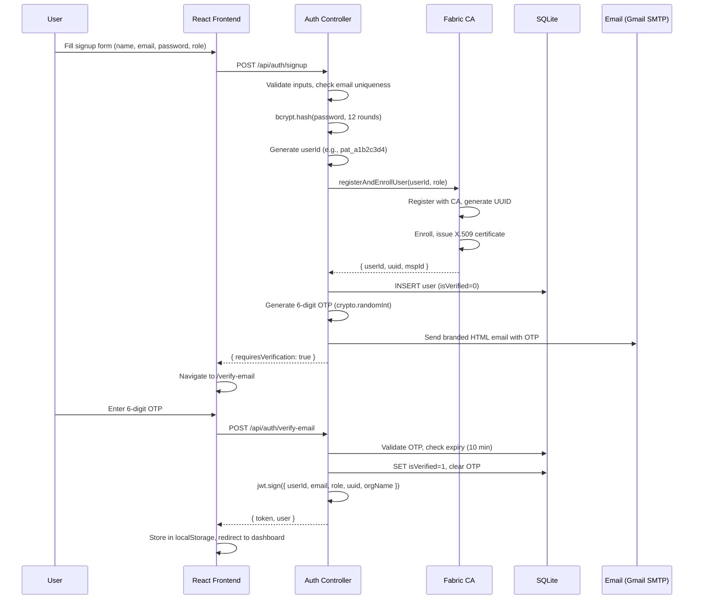

### Key Security Properties

- **No JWT before verification:** Signup returns `requiresVerification: true` — no token is issued until OTP is validated.
- **Generic error messages:** OTP validation returns "Invalid or expired verification code" for both wrong and expired OTPs, preventing enumeration.
- **Fabric wallet verification:** Both login and OTP verification check `identityExists(userId)` to ensure the blockchain identity is intact.
- **Role normalization:** Fabric uses `hospital` role; frontend maps it to `hospitalAdmin` via `ROLE_MAP` in AuthContext.

---

## 11. Blockchain Architecture

### 11.1 Network Topology

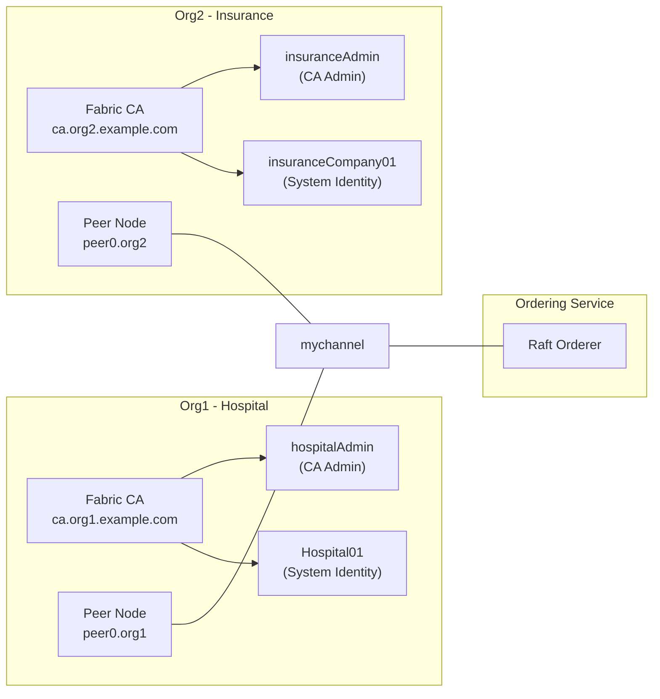

### 11.2 Smart Contract Functions (ehrChainCode)

The `ehrChainCode` contract (910 lines, JavaScript) implements 16 functions organized by domain:

| Function | Role Required | Key Type | Description |
|---|---|---|---|
| `onboardPatient` | any (via admin) | `patient-{uuid}` | Register patient with `authorizedDoctors: []` |
| `onboardDoctor` | hospital | `{doctorId}` | Register doctor with hospital association |
| `onboardInsurance` | insuranceAdmin | `{agentId}` | Register insurance agent |
| `addRecord` | doctor | Composite: `record\|[patientId, recordId]` | Create medical record (requires consent) |
| `getAllRecordsByPatientId` | doctor/hospital/patient | Composite query | Fetch all records via `getStateByPartialCompositeKey` |
| `getRecordById` | doctor/hospital/patient | Composite lookup | Single record retrieval |
| `getRecordsByDoctor` | doctor/hospital | Composite scan + filter | All records by a specific doctor |
| `grantAccess` | patient (owner only) | `patient-{uuid}` | Push doctorId to `authorizedDoctors[]` |
| `revokeAccess` | patient (owner only) | `patient-{uuid}` | Filter doctorId from `authorizedDoctors[]` |
| `getPatientById` | doctor (authorized)/patient (self) | `patient-{uuid}` | Patient data with consent check |
| `getAllPatients` | hospital | Range query `patient-` to `patient.` | List all patients |
| `issueInsurance` | insuranceAgent/insuranceAdmin | Composite: `policy\|[patientId, policyId]` | Create insurance policy |
| `getPoliciesByPatient` | patient (self)/insurance | Composite query | All policies for patient |
| `createClaim` | patient/doctor | Composite: `claim\|[patientId, claimId]` | File claim against active policy |
| `approveClaim` | insuranceAgent | Composite update | Set status to APPROVED/REJECTED |
| `fetchLedger` | hospital | Range query (full) | Return all simple-key entries |

### 11.3 Composite Key Strategy

The chaincode uses Fabric's composite keys to separate entity types while enabling efficient per-patient queries:

- **Simple keys:** `patient-{uuid}`, `{doctorId}`, `{agentId}` — returned by `fetchLedger()`
- **Composite keys:** `record|[patientId, recordId]`, `policy|[patientId, policyId]`, `claim|[patientId, claimId]` — **invisible** to `fetchLedger()`, queried via `getStateByPartialCompositeKey()`

This distinction is critical for the analytics service, which must make separate per-patient queries for records, policies, and claims.

---

## 12. IPFS + AES Encryption Architecture

### 12.1 Upload Flow

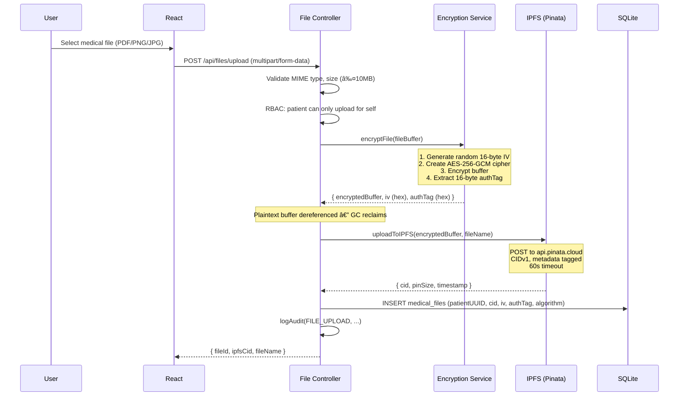

### 12.2 Download Flow

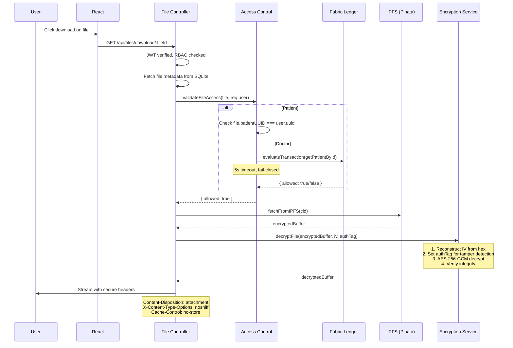

### 12.3 Cryptographic Details

- **Algorithm:** AES-256-GCM (Galois/Counter Mode)
- **Key:** 32-byte (256-bit) from `AES_ENCRYPTION_KEY` env var (64 hex chars)
- **IV:** 16 bytes, cryptographically random per file (`crypto.randomBytes(16)`)
- **Auth Tag:** 16 bytes (128-bit), provides authenticated encryption — detects tampering
- **Key storage:** Environment variable (never in database or IPFS)
- **IV + authTag storage:** SQLite `medical_files` table (separate from encrypted content)
- **Plaintext lifecycle:** Exists only in server memory during encrypt/decrypt — never written to disk, never sent to IPFS

---

## 13. Consent Management Flow

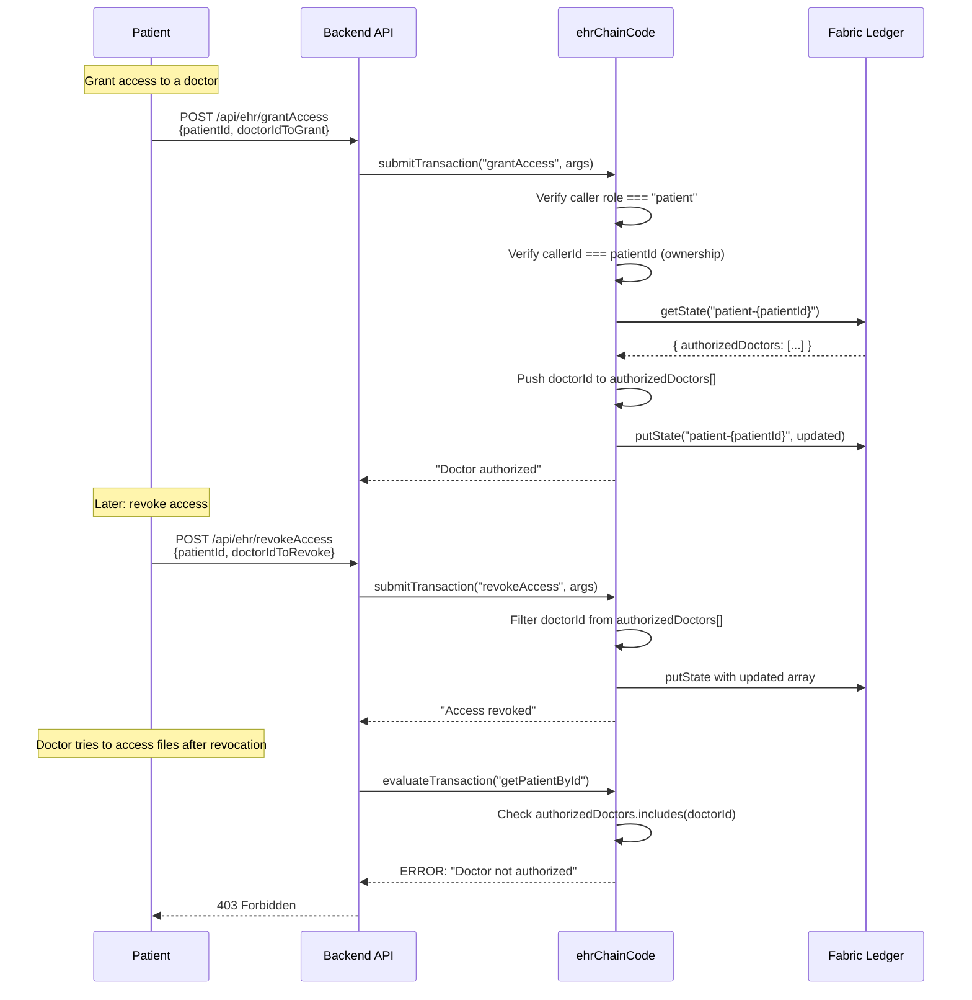

### Enforcement Points

1. **Chaincode level:** `addRecord()`, `getPatientById()`, `getRecordsByDoctor()` all check `authorizedDoctors.includes(callerId)`
2. **File controller level:** `validateFileAccess()` calls `checkDoctorConsent()` which queries the blockchain before allowing IPFS fetch
3. **Fail-closed design:** Any Fabric error or timeout (5s) results in access denial
4. **Immediate effect:** Revocation updates the ledger state; the next query reflects the change with no cache delay
## 14. Insurance Workflow

```mermaid
sequenceDiagram
    participant IA as Insurance Agent
    participant API as Backend
    participant CC as ehrChainCode
    participant P as Patient

    Note over IA: Step 1 — Issue Policy
    IA->>API: POST /api/ehr/issueInsurance
    Note over API: { patientId, coverageAmount,<br/>policyType, validFrom, validTo }
    API->>CC: submitTransaction("issueInsurance")
    CC->>CC: Verify role = insuranceAgent/insuranceAdmin
    CC->>CC: Verify patient exists on ledger
    CC->>CC: Generate policyId = "POL-{txId}"
    CC->>CC: Store under composite key policy|[patientId, policyId]
    CC-->>API: { policyId, message }

    Note over P: Step 2 — File Claim
    P->>API: POST /api/ehr/createClaim
    Note over API: { patientId, policyId, recordId,<br/>claimAmount, description }
    API->>CC: submitTransaction("createClaim")
    CC->>CC: Verify policy status = ACTIVE
    CC->>CC: Verify medical record exists (optional)
    CC->>CC: Generate claimId = "CLM-{txId}"
    CC->>CC: Store with status = PENDING
    CC-->>API: { claimId, message }

    Note over IA: Step 3 — Adjudicate Claim
    IA->>API: POST /api/ehr/approveClaim
    Note over API: { patientId, claimId,<br/>decision: APPROVED/REJECTED, reason }
    API->>CC: submitTransaction("approveClaim")
    CC->>CC: Verify claim status = PENDING
    CC->>CC: Set status, statusReason, reviewedBy, reviewedAt
    CC-->>API: { claimId, status: APPROVED }
```

### Claim Lifecycle States

| State | Transition | Actor |
|---|---|---|
| — → PENDING | `createClaim()` | Patient or authorized Doctor |
| PENDING → APPROVED | `approveClaim(decision: "APPROVED")` | Insurance Agent |
| PENDING → REJECTED | `approveClaim(decision: "REJECTED")` | Insurance Agent |
| APPROVED/REJECTED → * | **Blocked** — immutable once decided | — |

---

## 15. Audit Logging System

The audit service (`auditService.js`) implements enterprise-grade activity tracking:

### Action Types & Severity

| Action | Severity | Example Description |
|---|---|---|
| `LOGIN` | info | "Dr. Smith logged in" |
| `LOGIN_FAILED` | critical | "Failed login attempt for user@example.com" |
| `FILE_UPLOAD` | info | "Dr. Smith uploaded chest_xray.pdf" |
| `FILE_DOWNLOAD` | info | "Dr. Smith downloaded lab_results.pdf" |
| `GRANT_ACCESS` | info | "Patient John granted access to Dr. Smith" |
| `REVOKE_ACCESS` | warning | "Patient John revoked access from Dr. Smith" |
| `CREATE_CLAIM` | info | "Patient John filed an insurance claim: knee surgery" |
| `APPROVE_CLAIM` | info | "Agent Alice approved a claim — meets coverage criteria" |
| `ISSUE_POLICY` | info | "Agent Alice issued a Comprehensive insurance policy" |
| `ADD_RECORD` | info | "Dr. Smith created a medical record: Type 2 Diabetes" |
| `DASHBOARD_ACCESS` | info | "Admin accessed the dashboard" |

### Design Principles

1. **Fire-and-forget:** `logAudit()` never throws — audit failures don't block API responses
2. **Humanized descriptions:** The `humanize()` function resolves user IDs to names via a lightweight cache
3. **Name resolution:** Cross-references both `userId` and `uuid` against SQLite for display names
4. **Severity icons:** Maps to emoji indicators (🔴 critical, 🟡 warning, 🟢 info) for dashboard display

### Database Schema

```sql
CREATE TABLE audit_logs (
    id          INTEGER PRIMARY KEY AUTOINCREMENT,
    timestamp   DATETIME DEFAULT CURRENT_TIMESTAMP,
    actorId     TEXT,
    actorRole   TEXT,
    actionType  TEXT NOT NULL,
    severity    TEXT DEFAULT 'info',
    targetId    TEXT,
    targetType  TEXT,
    status      TEXT DEFAULT 'success',
    metadata    TEXT  -- JSON-stringified context
);
```

---

## 16. Dashboard & Analytics Architecture

### The Composite Key Problem

The `fetchLedger()` chaincode function returns only **simple-key** entries (patients, doctors, agents) via `getStateByRange('', '')`. Medical records, policies, and claims use **composite keys** and are invisible to this query. This is why early dashboard implementations showed all zeros.

### Server-Side Aggregation Solution

The `analyticsService.js` implements a two-phase data fetching strategy:

```
Phase 1: fetchLedger() via Hospital01 system account
  → Returns patients[], doctors[], agents[] (simple keys)

Phase 2: For each patient, query:
  → getAllRecordsByPatientId(patientId)    [composite: record|[pid, rid]]
  → getPoliciesByPatient(patientId)        [composite: policy|[pid, polid]]
  → getAllClaimsByPatient(patientId)        [composite: claim|[pid, clmid]]
  
Batched in groups of 5 concurrent patients for performance.
```

### Caching Strategy

- **TTL:** 60 seconds for all cached data
- **Keys:** `all_data`, `hospital_analytics`, `insurance_analytics`, `system_health`
- **Invalidation:** Manual via `POST /api/admin/invalidate-cache` or automatic TTL expiry

### Hospital Admin Metrics

| Metric | Source |
|---|---|
| Total Patients/Doctors/Agents | Simple-key classification |
| Total Records | Composite key aggregation |
| Total Policies/Claims | Composite key aggregation |
| Approved/Rejected/Pending Claims | Status field analysis |
| Doctor Leaderboard | Records grouped by doctorId |
| Monthly Activity | Timestamp extraction from records/claims/policies |
| Total Consents | Sum of authorizedDoctors[] array lengths |
| Encrypted Files | SQLite `medical_files` count |
| Audit Log Count | SQLite `audit_logs` count |

### Insurance Admin Metrics

| Metric | Source |
|---|---|
| Total Policies/Claims | Composite key aggregation |
| Approval Rate | `(approved / totalClaims) * 100` |
| Total Coverage | Sum of `coverageAmount` across policies |
| Policy Type Breakdown | Grouped by `policyType` field |
| Top Claimants | Claims grouped by `patientId` |
| Claim Timeline | Monthly claim count from timestamps |
| Recent Decisions | Last 10 APPROVED/REJECTED claims |

### System Health Monitoring

The `getSystemHealth()` function checks 6 subsystems:

| Component | Check Method | States |
|---|---|---|
| Fabric Network | Attempt `fetchAllData()` | healthy / error |
| IPFS Gateway | Check Pinata API keys configured | healthy / degraded |
| AES Encryption | Validate key length (64 hex chars = 32 bytes) | healthy / error |
| Ledger Sync | Check if `fetchAllData()` returns entries | healthy / degraded |
| Wallet Identities | `identityExists('Hospital01')` | healthy / degraded |
| SQLite Database | `getAllUsers()` returns rows | healthy / degraded / error |

---

## 17. Synthetic Data Generation

### Pipeline Architecture

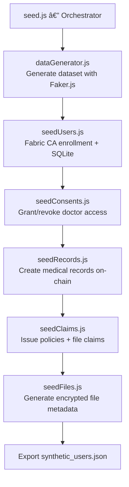

### Dataset Composition

| Entity | Count | Generation Method |
|---|---|---|
| Patients | ~15 | Faker.js names, DOBs, cities |
| Doctors | ~5 | Faker.js names, hospital affiliations |
| Insurance Agents | ~3 | Faker.js names, company names |
| Demo Accounts | 5 | Fixed emails for testing |
| Medical Records | ~241 | Realistic diagnoses, prescriptions |
| Insurance Policies | ~23 | Coverage amounts, policy types |
| Claims | ~20 | Linked to policies and records |
| Encrypted Files | ~112 | Simulated file metadata with AES params |

### Key Features

1. **Idempotency:** Checks `countSyntheticUsers()` before seeding; skips if data exists
2. **Seed versioning:** Stores version in `seed_metadata` table
3. **Dry-run mode:** `--dry-run` flag previews without writing
4. **Credential export:** Generates `synthetic_users.json` with all login credentials
5. **Demo accounts:** Fixed email addresses (`demo.patient@ehr.com`, etc.) with known password `TestPassword123!`
6. **Cleanup script:** `cleanup.js` removes all synthetic data (users + files) for fresh re-seeding

---

## 18. Deployment Architecture

### Current Development Setup

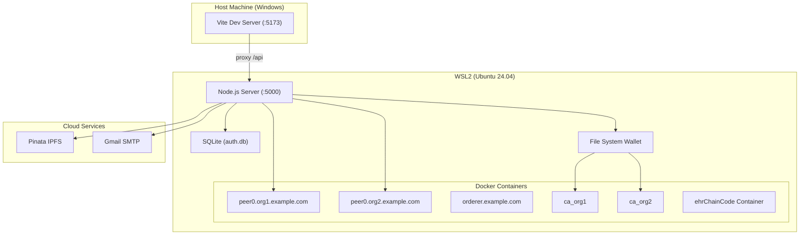

### Recommended Production Architecture

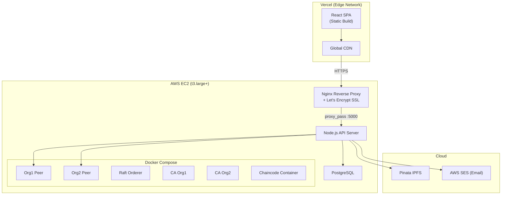

### Deployment Recommendations

| Component | Recommendation | Rationale |
|---|---|---|
| **Frontend** | Vercel | Zero-config React deployment, global CDN, automatic HTTPS, preview deployments |
| **Backend + Fabric** | AWS EC2 (t3.large) | Fabric peers require persistent Docker containers, local wallet access, low-latency peer communication |
| **Database** | PostgreSQL (RDS) | Production-grade concurrent access, better than SQLite for multi-connection scenarios |
| **IPFS** | Pinata (current) | Managed pinning service, no infrastructure overhead, reliable gateway |
| **Email** | AWS SES | Higher deliverability than Gmail SMTP, production rate limits |
| **SSL** | Let's Encrypt via Nginx | Free automated certificates, Nginx as reverse proxy |

### Why EC2 for Fabric

Hyperledger Fabric requires: persistent Docker containers for peers/orderers/CAs, local file system wallet for X.509 certificates, low-latency communication between peers and orderer, and direct Docker socket access. Serverless platforms (Lambda, Cloud Functions) cannot host Fabric peers.

### Environment Variables Management

Production deployment requires secure management of 8 environment variables:
- `JWT_SECRET` — cryptographically random string
- `AES_ENCRYPTION_KEY` — 64 hex chars (32 bytes)
- `PINATA_API_KEY` / `PINATA_SECRET_API_KEY` — IPFS access
- `EMAIL_USER` / `EMAIL_APP_PASSWORD` — SMTP credentials
- `PORT` — server port
- `JWT_EXPIRES_IN` — token TTL

**Recommendation:** AWS Secrets Manager or SSM Parameter Store for production; Docker secrets for compose-based deployments.

---

## 19. Security Features

### Multi-Layer Security Model

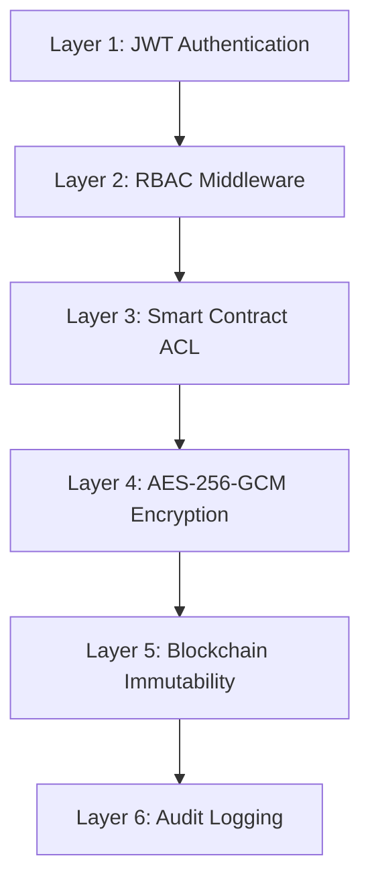

| Layer | Implementation | Threat Mitigated |
|---|---|---|
| **JWT Authentication** | `jsonwebtoken` with HS256, 24h expiry, `Bearer` scheme | Unauthorized API access |
| **OTP Verification** | 6-digit code via `crypto.randomInt`, 10-min expiry, generic errors | Account hijacking, email enumeration |
| **RBAC Middleware** | `requireRole([...])` factory function, 403 on violation | Privilege escalation |
| **Smart Contract ACL** | `getCallerAttributes(ctx)` reads X.509 cert attributes | Forged identity, role spoofing |
| **Blockchain Consent** | `authorizedDoctors[]` checked before record/file access | Unauthorized data access |
| **AES-256-GCM** | Authenticated encryption, random IV per file, authTag tamper detection | Data breach, file tampering |
| **IPFS Content Addressing** | CID-based retrieval ensures content integrity | Content substitution |
| **Audit Logging** | Fire-and-forget, severity-tagged, humanized | Compliance, forensics |
| **Secure Headers** | `X-Content-Type-Options: nosniff`, `Cache-Control: no-store` | MIME sniffing, cache attacks |
| **Fail-Closed Design** | Consent timeout (5s) → deny, any error → deny | Fail-open vulnerabilities |
| **Password Hashing** | bcrypt with 12 salt rounds | Credential theft |
| **Auto-401 Redirect** | Axios interceptor clears localStorage on 401 | Stale token attacks |

---

## 20. Testing & Validation

### Synthetic Data Validation

The seed script validates the complete data pipeline:

| Test | Method | Expected |
|---|---|---|
| User enrollment | Fabric CA register + enroll | X.509 cert in wallet |
| Chaincode onboarding | `onboardPatient/Doctor/Insurance` | Entity on ledger |
| Consent flow | `grantAccess` then `addRecord` | Record created |
| Revocation | `revokeAccess` → doctor file access | 403 denied |
| Policy issuance | `issueInsurance` | Policy on ledger |
| Claim lifecycle | `createClaim` → `approveClaim` | Status = APPROVED |
| File encryption | `encryptFile` → `decryptFile` roundtrip | Matching buffers |

### API Testing

Postman collection (`EHR-APIs.postman_collection.json`) covers all 17 EHR endpoints, auth flows, and file operations.

---

## 21. Results & Observations

1. **Ledger Performance:** Fabric processes ~5 transactions/second for record creation; batch seeding of 241 records completes in ~48 seconds.
2. **Analytics Aggregation:** The two-phase fetch (simple keys + composite keys per patient) takes 2-5 seconds for ~15 patients, cached for 60 seconds.
3. **Encryption Overhead:** AES-256-GCM adds <50ms per file for typical medical documents (≤10MB).
4. **IPFS Upload:** Pinata upload averages 1-3 seconds per file; fetch via gateway averages 500ms-2s.
5. **Consent Enforcement:** Blockchain consent queries complete in <500ms via `evaluateTransaction` (read-only, no ordering).
6. **JWT Auth:** Token verification adds <1ms per request (HS256 is computationally trivial).

---

## 22. Challenges Faced

1. **Composite Key Invisibility:** `fetchLedger()` only returns simple-key entries. Records, policies, and claims stored under composite keys required a separate aggregation strategy with per-patient queries.
2. **Iterator API Changes:** Fabric SDK's iterator changed from `for await...of` to manual `.next()` loop, causing silent empty results until fixed.
3. **Cross-Org Analytics:** Insurance Admin (Org2) cannot call `fetchLedger()` (restricted to hospital role). Solved by using a system account (`Hospital01`) for all analytics queries.
4. **Role Normalization:** Fabric uses `hospital` as a role attribute; frontend expects `hospitalAdmin`. Required a mapping layer in AuthContext.
5. **OTP Security:** Balancing usability (10-min expiry) with security (generic error messages to prevent enumeration).

---

## 23. Future Scope

1. **Zero-Knowledge Proofs:** Implement ZKP for insurance claim verification — prove eligibility without revealing full medical records.
2. **Multi-Channel Architecture:** Separate channels for hospital-only data vs. insurance-shared data.
3. **FHIR Compliance:** Map medical records to HL7 FHIR standard for interoperability with existing EHR systems.
4. **Mobile Application:** React Native client for patient-side record viewing and consent management.
5. **Hardware Security Module (HSM):** Store AES keys in HSM instead of environment variables.
6. **Distributed Ordering:** Multi-node Raft cluster for orderer high availability.
7. **Real-time Notifications:** WebSocket-based push notifications for consent changes and claim decisions.
8. **Data Encryption at Rest:** Encrypt SQLite database file with SQLCipher.
9. **Automated Compliance Reporting:** HIPAA audit report generation from audit logs.
10. **Inter-Hospital Federation:** Support multiple hospital organizations on the same channel.

---

## 24. Conclusion

Sanchay demonstrates a production-viable architecture for blockchain-powered healthcare data management. By combining Hyperledger Fabric's permissioned blockchain with AES-256-GCM encryption and IPFS decentralized storage, the platform achieves:

- **Data Integrity:** Every medical record, policy, and claim is immutably recorded on the blockchain with composite key isolation.
- **Patient Sovereignty:** Consent is managed through blockchain-backed authorization arrays with immediate revocation enforcement.
- **Defense in Depth:** Six security layers (JWT → RBAC → Smart Contract ACL → AES Encryption → Blockchain Immutability → Audit Logging) ensure no single point of compromise.
- **Operational Transparency:** Enterprise audit logging with humanized descriptions, severity classification, and fire-and-forget reliability.
- **Decentralized Storage:** Medical files never exist as plaintext on any storage system — encrypted before IPFS upload, decrypted only in server memory during authorized downloads.

The multi-organization Fabric network (Hospital Org1, Insurance Org2) maps directly to real-world healthcare stakeholder relationships, with X.509 certificate-based identity providing cryptographic proof of participant identity.

---

## 25. References

1. Hyperledger Fabric Documentation — https://hyperledger-fabric.readthedocs.io/
2. Fabric Node SDK — https://hyperledger.github.io/fabric-sdk-node/
3. IPFS Protocol Specification — https://docs.ipfs.tech/
4. Pinata IPFS Pinning API — https://docs.pinata.cloud/
5. AES-GCM (NIST SP 800-38D) — https://csrc.nist.gov/publications/detail/sp/800-38d/final
6. JSON Web Tokens (RFC 7519) — https://tools.ietf.org/html/rfc7519
7. React Documentation — https://react.dev/
8. Express.js — https://expressjs.com/
9. better-sqlite3 — https://github.com/WiseLibs/better-sqlite3
10. Faker.js — https://fakerjs.dev/
